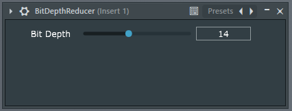

# BitDepthReducer
BitDepthReducer is a VST3 audio plugin that allows you to reduce the bit depth of your audio stream.

# Downloads [BitDepthReducer 1.0](https://github.com/Cyril-Meyer/BitDepthReducer/releases/tag/1.0)

# Example audio results:

https://user-images.githubusercontent.com/69190238/132735736-06f83c95-3ad4-400e-80ec-7ab969d724ef.mov

https://user-images.githubusercontent.com/69190238/132735742-90c0a99f-1e83-4001-8556-f5005e61622b.mov

https://user-images.githubusercontent.com/69190238/132735744-6edc6411-4e3e-42e8-8856-95ce903893bb.mov

# Acknowledgement

Special thanks to [Image-Line](https://www.image-line.com/) which allows us to always test our plugins on the latest FL Studio.

Also thanks to [Juce](https://juce.com/) which provide a free and open-source audio plugin framework.

